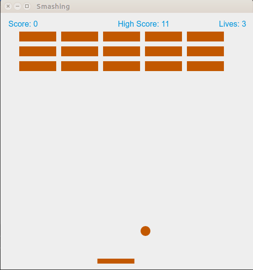

# Breakout Video Game

## Overview
<b>Developed using Electron and Javascript<b>

Application structure:

- `package.json` - Points to the app's main file and lists its details and dependencies.
- `main.js` - Starts the app and creates a browser window to render HTML. This is the app's **main process**.
- `index.html` - A web page to render. This is the app's <b>renderer process</b>.

## Usage

```
# Clone the repository
git clone https://github.com/prabodhw96/Breakout-Video-Game.git
# Go into the repository
cd Breakout-Video-Game
# Install dependencies
npm install
# Run app
npm start
```

<b>Illustration</b>

